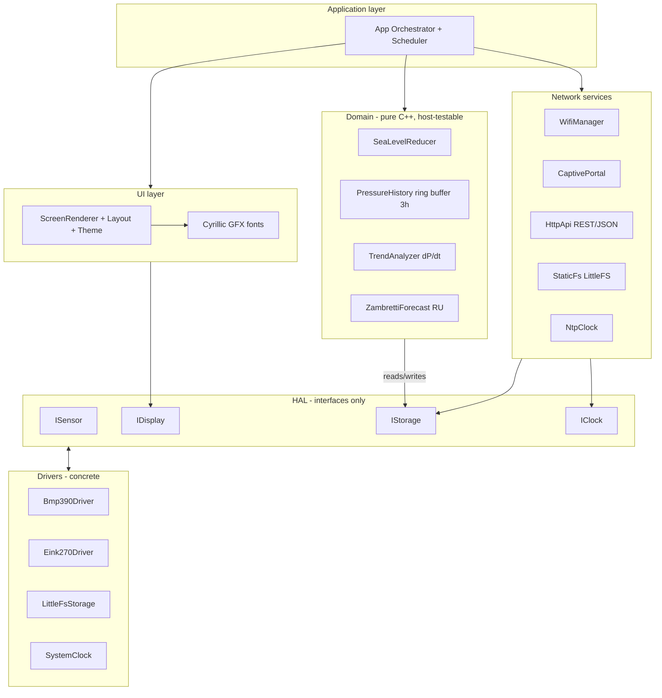
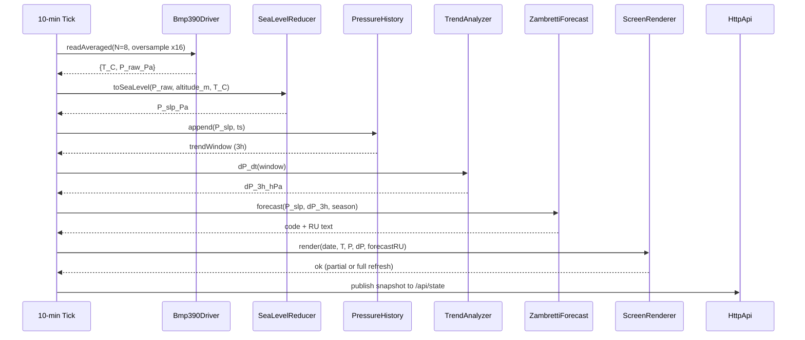

# pocketmeteo — Архитектура

Связанные документы:

- План разработки: [`DEVELOPMENT_PLAN.md`](DEVELOPMENT_PLAN.md)
- Корневое описание/быстрый старт: [`../README.md`](../README.md)

## 1. Контекст и цели

**Цель проекта**: метеостанция на ESP32‑C3, измеряющая температуру и давление (BMP390), строящая краткосрочную оценку тренда давления и текстовый прогноз (Zambretti), отображающая данные на e‑Ink, и предоставляющая веб‑дашборд + REST/JSON API через постоянно включённый Wi‑Fi.

**Ключевые требования/ограничения** (зафиксированные):

- **МК**: ESP32‑C3 (одноядерный RISC‑V, ~4 MB flash).
- **Среда**: Arduino IDE 2.x для разработки; `arduino-cli` для CI и воспроизводимых сборок. **Без PlatformIO**.
- **Датчик**: BMP390 по I²C (Adafruit BMP3XX) с oversampling + IIR.
- **Дисплей**: Waveshare 2.7" 264×176 монохромный, драйвер `GxEPD2_270`, SPI пины: `CS=10, DC=4, RST=3, BUSY=2, SCLK=6, MOSI=7`.
- **Wi‑Fi**: всегда включён. Первичная настройка через AP + captive portal, затем STA с веб‑сервером + API + NTP.
- **Deep sleep**: отключён; вместо этого — modem‑sleep и периодическая задача измерений раз в 10 минут.
- **Язык экрана**: только русский → нужны кириллические GFX‑шрифты.

## 2. Высокоуровневая архитектура

Архитектура слоистая, «почти гексагональная»: доменная логика изолирована от Arduino/железа интерфейсами (HAL) и может собираться/тестироваться на хосте.



### 2.1 Обоснование разделения

- **Domain**: чистый C++17 (без `Arduino.h`), чтобы тестировать Zambretti/тренды/буферы на ПК и не блокироваться железом.
- **HAL**: тонкие интерфейсы, через которые Domain/UI/Net получают доступ к времени/хранению/экрану/датчикам.
- **Drivers**: единственное место, где разрешены Arduino‑API и конкретные библиотеки (Wire/SPI/WiFi/LittleFS, GxEPD2, Adafruit BMP3XX).
- **App**: оркестратор и политика обновления/планировщик.

## 3. Раскладка репозитория (целевая)

Проект реализуется как Arduino‑скетч в подкаталоге `pocketmeteo/` (Arduino IDE требует `.ino` в одноимённой папке). Внутри скетча `src/` компилируется рекурсивно, что позволяет модульность без вынесения в отдельные Arduino‑libraries.

```
pocketmeteo/                       # корень репозитория
├── pocketmeteo/                   # папка-скетч (имя совпадает с .ino)
│   ├── pocketmeteo.ino            # тонкий вход: setup()/loop() → src/app/App
│   ├── src/
│   │   ├── app/
│   │   ├── hal/
│   │   ├── drivers/
│   │   ├── domain/
│   │   ├── ui/
│   │   ├── net/
│   │   ├── config/
│   │   └── log/
│   ├── data/                      # статика для LittleFS (дашборд)
│   └── libraries.txt              # pinned зависимости для arduino-cli
├── tests/desktop/                 # хост-тесты доменной логики (CMake)
├── tools/                         # fontconvert + CI-скрипты
├── docs/
│   ├── ARCHITECTURE.md
│   ├── DEVELOPMENT_PLAN.md
│   └── ADR/
└── README.md
```

**Конвенции кода (важно для тестируемости):**

- `src/domain/*` и `src/hal/*` **не подключают `Arduino.h`** и не используют `String`, `Serial`, `delay()`.
- Строки — `std::string` / `std::string_view`. Время/задержки — через абстракции (`IClock`) или монотонный таймер в драйвере.

## 4. Потоки данных

### 4.1 Основной 10‑минутный цикл



### 4.2 Веб‑доступ

- Дашборд грузится из LittleFS (`/` → `index.html`).
- Клиент опрашивает `GET /api/state` для текущих показаний и прогнозов.
- Для графика используется `GET /api/history?range=24h`.

## 5. Подсистемы

### 5.1 Датчик (BMP390)

- Интерфейс `ISensor`: чтение температуры/давления.
- `Bmp390Driver`:
  - I²C, проверка наличия сенсора на старте.
  - Аппаратный oversampling + IIR для устойчивости.
  - Возможность усреднения \(N\) измерений, чтобы снизить шум.

### 5.2 Дисплей (Waveshare 2.7" e‑Ink)

- Интерфейс `IDisplay`: минимальные операции (инициализация, очистка, вывод текстовых блоков/линий, commit/refresh).
- `Eink270Driver`:
  - основан на `GxEPD2_270`;
  - поддерживает **частичное обновление** для 10‑минутного цикла;
  - периодическое **полное обновление** для борьбы с ghosting (см. ADR‑0005).

### 5.3 Хранение

Интерфейс `IStorage` предоставляет:

- текущий snapshot (последнее значение состояния);
- историю давления (кольцевой буфер);
- конфиг пользователя (altitude, tz, Wi‑Fi).

Реализация: комбинированная:

- **RTC slow RAM**: основной ring‑buffer истории давления (переживает soft reset).
- **LittleFS**: чекпоинт для стойкости к потере питания (каждые N сэмплов) и хранение статических файлов дашборда.
- **Preferences (NVS)**: долговременный конфиг (altitude_m, ssid/psk, tz, политика обновления).

### 5.4 Сеть и провижининг

**Первый запуск**:

- поднимаем AP `pocketmeteo-XXXX`;
- `DNSServer` редиректит все домены на IP AP (captivity);
- локальный `WebServer` отдаёт страницу настройки, принимает `ssid/psk`, `altitude_m`, `TZ`;
- сохраняем в `Preferences`, ребут, уходим в STA.

**STA режим**:

- STA подключение к Wi‑Fi;
- mDNS: `pocketmeteo.local`;
- HTTP:
  - статика `/` из LittleFS;
  - REST/JSON API `/api/*` (см. раздел 6).

### 5.5 Время

- `NtpClock` / `SystemClock`:
  - синхронизация через SNTP (`configTzTime`);
  - дефолт: `TZ=Europe/Moscow`, настраиваемо.
- Монотонные интервалы и будильники: `esp_timer_get_time()`.

### 5.6 Планировщик и политика обновления

- Одна FreeRTOS‑задача `MeasurementTask`, пробуждаемая каждые 600 секунд через `esp_timer`.
- Wi‑Fi в режиме энергосбережения: `WIFI_PS_MAX_MODEM` (DTIM‑зависимый modem‑sleep).
- Политика обновления e‑Ink:
  - частичное обновление каждый цикл;
  - полное обновление: каждые 12 циклов (~2 часа) **или** при смене категории тренда.

## 6. API (v1)

Эндпоинты (фиксируются в реализации P8):

- `GET /api/state` — текущий снимок (T, P, P_slp, dP_3h, forecast_ru, ts).
- `GET /api/history?range=24h` — ряд давления для графика.
- `GET /api/config` / `POST /api/config` — `altitude_m`, `tz`, политика обновления.
- `POST /api/refresh` — принудительное обновление дисплея.
- `GET /api/logs` — последние N строк логов.

Формат JSON — через `ArduinoJson` 7.x.

## 7. Логирование

- Макросы `LOG_I/W/E` пишут:
  - в UART (USB CDC);
  - в кольцевой буфер в RAM (для `GET /api/logs`).

## 8. Питание (модель)

Deep sleep не используется. Экономия достигается за счёт:

- **modem‑sleep** Wi‑Fi (`WIFI_PS_MAX_MODEM`);
- редких измерений (раз в 10 минут);
- коротких окон активности e‑Ink.

В `DEVELOPMENT_PLAN.md` и ADR фиксируется таблица режимов с типичными токами:

- idle (CPU + Wi‑Fi modem‑sleep)
- measure (I²C активность)
- refresh (SPI + e‑Ink refresh)
- wifi‑tx (ответы на HTTP)

## 9. Тестирование и CI

### 9.1 Хост‑тесты доменной логики

Отдельный CMake‑проект `tests/desktop/` компилирует `pocketmeteo/src/domain/*.cpp` и `pocketmeteo/src/hal/*.h` напрямую (без Arduino). Фреймворк (Doctest или Catch2 v3) выбирается на фазе P1.

Локально:

```
cmake -S tests/desktop -B build
cmake --build build
ctest --test-dir build --output-on-failure
```

### 9.2 Сборка прошивки в CI

GitHub Actions (Ubuntu) с `arduino-cli`:

```
arduino-cli core install esp32:esp32@<pinned>
arduino-cli lib install --no-deps $(cat pocketmeteo/libraries.txt)
arduino-cli compile -b esp32:esp32:esp32c3 pocketmeteo/
```

### 9.3 On‑target smoke tests (опционально)

Отдельный скетч `tests/onboard/test_runner.ino` (в P2) для проверки:

- BMP390 chip‑ID по I²C
- init e‑Ink
- LittleFS read/write
- NTP sync

## 10. ADR (Architecture Decision Records)

`docs/ADR/` содержит нумерованные решения. На старте фиксируются:

- **ADR‑0001**: Arduino IDE 2.x + `arduino-cli` (CI), PlatformIO отклонён.
- **ADR‑0002**: Wi‑Fi always on; без deep sleep; периодическая задача измерений.
- **ADR‑0003**: История давления: RTC slow RAM + чекпоинт в LittleFS.
- **ADR‑0004**: Кириллические GFX‑шрифты через `fontconvert` из TTF; `FreeSans*` не подходит.
- **ADR‑0005**: Политика partial/full refresh для борьбы с ghosting.
- **ADR‑0006**: HTTP стек: синхронный `WebServer` (v1), с возможной миграцией на async позже.
- **ADR‑0007**: Время: SNTP + `configTzTime`, монотонность через `esp_timer_get_time()`.
- **ADR‑0008**: Логи: UART + RAM ring buffer + `/api/logs`.
- **ADR‑0009**: Domain/HAL без `Arduino.h`, совместимо с хост‑сборкой.

