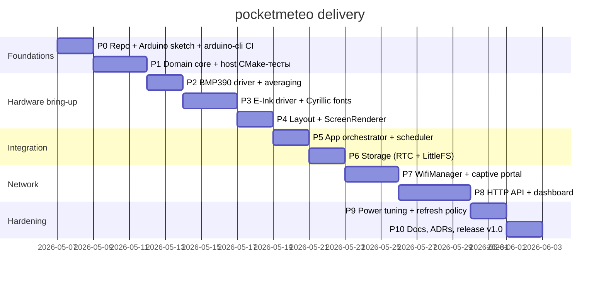

# pocketmeteo — План разработки (P0–P10)

Связанные документы:

- Архитектура: [`ARCHITECTURE.md`](ARCHITECTURE.md)
- Корневое описание/быстрый старт: [`../README.md`](../README.md)

## 0. Принципы поставки

- **Инкрементальная поставка**: каждая фаза даёт работающий инкремент (или проверяемый артефакт).
- **Тестируемость домена**: `src/domain` и `src/hal` не зависят от Arduino, чтобы развивать логику через хост‑тесты.
- **Wi‑Fi always on**: архитектура и тест‑план исходят из того, что радио не выключается (deep sleep отсутствует).
- **Русский на экране**: закладываем шрифты и рендеринг кириллицы как часть бринг‑апа дисплея.

## 1. Фазы

Ниже — описание каждой фазы: **цель**, **изменяемые файлы/папки**, **публичные интерфейсы**, **критерии приёмки**, **риски**, **откат**.

---

## P0 — Repo + Arduino sketch + `arduino-cli` CI

### Цель

Создать минимальный рабочий каркас Arduino‑проекта для ESP32‑C3 с модульной структурой (`src/`), плюс воспроизводимую сборку через `arduino-cli` (локально и в CI).

### Файлы/папки

- `pocketmeteo/pocketmeteo.ino`
- `pocketmeteo/src/` (минимальная структура слоёв)
- `pocketmeteo/libraries.txt` (пинованные зависимости)
- `.github/workflows/ci.yml` (если используете GitHub Actions)
- `tools/ci/` (скрипты, если нужно)

### Публичные интерфейсы

- Точка входа скетча: `setup()` / `loop()` — только делегирование в `src/app/App`.

### Критерии приёмки

- Скетч компилируется для `ESP32C3 Dev Module`.
- `arduino-cli compile -b esp32:esp32:esp32c3 pocketmeteo/` проходит в чистой среде.
- Логи в Serial (USB CDC) работают.

### Риски

- Несовпадение названия board fqbn и установленного core.
- Ошибки с путями/кодировкой на Windows.

### Откат

- Свести скетч к минимальному `setup/loop` и временно убрать `src/` модульность, если Arduino IDE не подхватывает файлы.

---

## P1 — Domain core + host CMake‑тесты

### Цель

Реализовать доменную логику как «чистый» C++17 и покрыть её хост‑тестами: история давления, тренд, приведение к уровню моря, Zambretti.

### Файлы/папки

- `pocketmeteo/src/domain/*`
- `pocketmeteo/src/hal/*` (интерфейсы)
- `tests/desktop/CMakeLists.txt` + `tests/desktop/test_*.cpp`

### Публичные интерфейсы

- `SeaLevelReducer` (приведение давления к уровню моря)
- `PressureHistory` (ring‑buffer, минимум 3 часа @ 10 минут)
- `TrendAnalyzer` (dP за 3 часа)
- `ZambrettiForecast` (код + русский текст)

### Критерии приёмки

- Доменные файлы собираются в Arduino и на хосте (CMake).
- Тесты проходят локально:
  - `cmake -S tests/desktop -B build`
  - `cmake --build build`
  - `ctest --test-dir build --output-on-failure`
- Нет зависимостей от `Arduino.h` в `domain/` и `hal/`.

### Риски

- Выбор тест‑фреймворка увеличит размер/сложность сборки.
- Неявные зависимости (например, `String`) просочатся в домен.

### Откат

- Временно убрать CMake‑часть и оставить домен под Arduino, если блокирует прогресс; вернуть хост‑тесты после стабилизации интерфейсов.

---

## P2 — BMP390 driver + averaging

### Цель

Поднять датчик BMP390 по I²C, настроить oversampling + IIR, реализовать усреднение и выдачу стабильных значений температуры и давления.

### Файлы/папки

- `pocketmeteo/src/drivers/Bmp390Driver.*`
- `pocketmeteo/src/hal/ISensor.*`
- (опционально) `tests/onboard/test_runner.ino`

### Публичные интерфейсы

- `ISensor::read()` / `readAveraged(...)` (точная сигнатура фиксируется в реализации).

### Критерии приёмки

- На реальном железе:
  - сенсор обнаруживается;
  - выдаёт правдоподобные значения;
  - усреднение снижает шум (видно по логам).

### Риски

- Пины I²C/питание, качество проводов.
- Некорректная конфигурация фильтра/оверсэмплинга → шум.

### Откат

- Отключить усреднение/фильтрацию и вывести «сырые» данные для диагностики.

---

## P3 — e‑Ink driver + Cyrillic fonts

### Цель

Поднять Waveshare 2.7" e‑Ink через `GxEPD2_270`, настроить частичное/полное обновление, подготовить кириллические шрифты для `Adafruit_GFX`.

### Файлы/папки

- `pocketmeteo/src/drivers/Eink270Driver.*`
- `pocketmeteo/src/hal/IDisplay.*`
- `pocketmeteo/src/ui/fonts/` (сгенерированные `.h` шрифты кириллицы)
- `tools/fontconvert/` (утилиты/инструкции)

### Публичные интерфейсы

- `IDisplay` (init/clear/drawText/commit и т. п.)
- API рендера текста в UI‑слое (не HTTP API).

### Критерии приёмки

- Экран инициализируется и рисует тестовый экран.
- Кириллица отображается корректно (без «квадратиков»).
- Частичное обновление работает; полное обновление убирает ghosting.

### Риски

- Неправильные SPI пины или уровни.
- Подбор шрифта/лицензия на TTF.

### Откат

- Временно использовать латинский шрифт и ASCII‑экран для проверки драйвера.

---

## P4 — Layout + `ScreenRenderer`

### Цель

Собрать UI‑слой: компоновка экрана, тема, отрисовка показаний (T, P, тренд, прогноз), политика частичного обновления отдельных регионов.

### Файлы/папки

- `pocketmeteo/src/ui/ScreenRenderer.*`
- `pocketmeteo/src/ui/Layout.*`
- `pocketmeteo/src/ui/Theme.*`

### Публичные интерфейсы

- `ScreenRenderer::render(StateSnapshot, RenderPolicy)` (сигнатура уточняется).

### Критерии приёмки

- Экран читабелен на реальном дисплее.
- Обновление раз в 10 минут не оставляет чрезмерного ghosting.
- Все строки на русском.

### Риски

- Ограничения частичного обновления конкретного дисплея/контроллера.

### Откат

- Упростить UI до одного экрана/полного обновления и вернуться к оптимизации позже.

---

## P5 — App orchestrator + scheduler

### Цель

Свести подсистемы в одно приложение: расписание измерений каждые 10 минут, публикация snapshot, инициирование обновлений экрана.

### Файлы/папки

- `pocketmeteo/src/app/App.*`
- `pocketmeteo/src/app/Scheduler.*`
- `pocketmeteo/src/log/Log.*`

### Публичные интерфейсы

- `App::begin()` / `App::loop()` либо `App::runOnceTick()` (как решите в коде).

### Критерии приёмки

- На устройстве:
  - цикл измерений стабильно выполняется каждые 10 минут;
  - состояние логируется;
  - UI обновляется по политике.

### Риски

- Параллельность/блокировки в `WebServer` могут мешать расписанию.

### Откат

- Временно сделать планировщик в `loop()` с проверкой времени без FreeRTOS‑задачи, если будут сложности.

---

## P6 — Storage (RTC + LittleFS)

### Цель

Реализовать хранение истории давления и конфигурации:

- history (3 часа и/или 24 часа для графика)
- конфиг (altitude, tz)
- чекпоинт устойчивости

### Файлы/папки

- `pocketmeteo/src/drivers/LittleFsStorage.*`
- `pocketmeteo/src/hal/IStorage.*`
- `pocketmeteo/src/config/Config.*`

### Публичные интерфейсы

- `IStorage` (appendHistory/getHistory/getSnapshot/setSnapshot…)
- `Config` (altitude_m, tz, refresh policy, Wi‑Fi creds через Preferences)

### Критерии приёмки

- История наполняется и читается.
- После перезагрузки данные/конфиг восстанавливаются (в рамках выбранной политики).
- LittleFS монтируется, статика дашборда доступна.

### Риски

- RTC slow RAM инициализация/сохранность.
- Износ flash при слишком частых чекпоинтах.

### Откат

- Хранить всё в RAM без чекпоинта на первом шаге и добавить стойкость позже.

---

## P7 — `WifiManager` + captive portal

### Цель

Сделать первичную настройку через AP + captive portal, затем стабильный STA режим. Добавить mDNS.

### Файлы/папки

- `pocketmeteo/src/net/WifiManager.*`
- `pocketmeteo/src/net/CaptivePortal.*`
- `pocketmeteo/src/net/NtpClock.*` (или `SystemClock` часть)

### Публичные интерфейсы

- Процедуры:
  - `startProvisioningAP()`
  - `connectSTA()`
  - `isProvisioned()`

### Критерии приёмки

- «Чистое» устройство:
  - поднимает AP `pocketmeteo-XXXX`;
  - браузер попадает на страницу настройки;
  - введённые данные сохраняются и после ребута подключается к Wi‑Fi.
- `pocketmeteo.local` резолвится в сети.

### Риски

- Разное поведение captive portal на Android/iOS.
- Стабильность STA при плохом сигнале.

### Откат

- Временно убрать DNS‑перехват и оставить явный IP/URL страницы настроек.

---

## P8 — HTTP API + dashboard

### Цель

Поднять синхронный `WebServer` с:

- отдачей статических файлов из LittleFS (`/`)
- REST/JSON API (`/api/*`)
- минимальным веб‑дашбордом (vanilla HTML/CSS/JS) + небольшой график давления

### Файлы/папки

- `pocketmeteo/src/net/HttpApi.*`
- `pocketmeteo/src/net/StaticFs.*`
- `pocketmeteo/data/index.html`
- `pocketmeteo/data/app.js`
- `pocketmeteo/data/styles.css`

### Публичные интерфейсы

Эндпоинты v1:

- `GET /api/state`
- `GET /api/history?range=24h`
- `GET /api/config` / `POST /api/config`
- `POST /api/refresh`
- `GET /api/logs`

### Критерии приёмки

- Дашборд открывается по IP и по `pocketmeteo.local`.
- API возвращает валидный JSON и соответствует текущему состоянию.
- График истории строится из `GET /api/history`.

### Риски

- Синхронный `WebServer` может блокировать измерения при большом количестве запросов.

### Откат

- Ограничить частоту опроса на фронтенде и/или уменьшить объём отдаваемой истории.

---

## P9 — Power tuning + refresh policy

### Цель

Стабилизировать энергопотребление (modem‑sleep), уточнить политику обновления дисплея, добавить метрики и «охранные» механизмы.

### Файлы/папки

- `pocketmeteo/src/app/*` (политика расписания/refresh)
- `pocketmeteo/src/net/*` (rate limiting, если нужно)
- `docs/ADR/*` (фиксация решений)

### Публичные интерфейсы

- Конфиг refresh policy (через `POST /api/config`).

### Критерии приёмки

- Устройство работает сутками без деградации.
- Ghosting контролируется (full refresh по расписанию/условию).
- Wi‑Fi держится в modem‑sleep, когда нет трафика.

### Риски

- Плавающее энергопотребление из‑за среды Wi‑Fi.

### Откат

- Вернуться к более частому full refresh и/или отключить некоторые фоновые функции, если наблюдается нестабильность.

---

## P10 — Docs, ADRs, release v1.0

### Цель

Довести документацию, зафиксировать ADR, подготовить релиз v1.0.

### Файлы/папки

- `docs/ADR/ADR-0001-...md` и далее
- `README.md` (обновить под фактическую структуру/команды)
- `LICENSE`
- `CHANGELOG.md` (опционально)

### Публичные интерфейсы

- Стабильный контракт REST API v1.
- Пинованные версии зависимостей и core.

### Критерии приёмки

- Документация согласована с реализацией.
- Воспроизводимая сборка в CI зелёная.
- Тег релиза v1.0, артефакты/инструкции опубликованы.

### Риски

- Документация расходится с кодом из‑за быстрых правок.

### Откат

- Отложить релиз, заморозить API и закрыть расхождения документ‑код.

---

## 2. Открытые пункты (сознательно отложены)

- Мониторинг батареи (ADC‑делитель) — заглушка API в `IPower` для v1.1.
- BLE‑провижининг как альтернатива captive portal — v1.2.
- Датчик влажности (например, AHT20) — интерфейс готов, драйвер позже.
- Возможная миграция на `ESPAsyncWebServer` при росте нагрузки (v1.1+).

